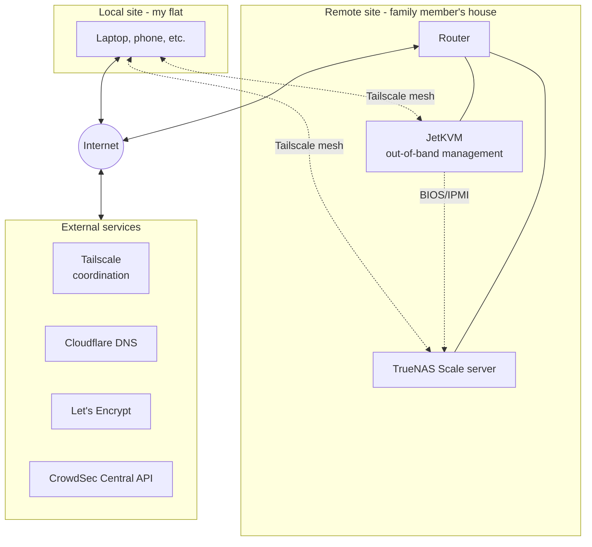
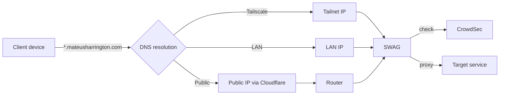
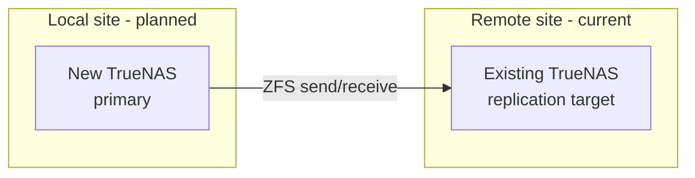

# Architecture

This document describes how the homelab is structured, how data and
requests flow through it, and the reasoning behind key design choices.

## Overview

The homelab currently consists of a single TrueNAS Scale server hosted
**off-site at a family member's house**. All services run as Docker
Compose stacks managed by Dockge/Dockhand. Remote access is via
Tailscale; no services are exposed publicly currently.
reverse proxy.

This off-site arrangement is unusual but deliberate: it provides
geographic redundancy for storage, low-friction backups for family
members on the same network, and isolates noisy/power-hungry hardware
from my flat. It also creates interesting operational constraints -
notably, no physical access for recovery - which have shaped several
design decisions (see ADRs).

## Physical and network topology



## Service access patterns

All services are accessed via nice domain names (e.g.
`immich.tail.mateusharrington.com`) regardless of access path. There are
three ways a request can reach a service:

1. **Public** — no services currently exposed; SWAG + CrowdSec is in
   place for when this changes.
2. **Tailscale (personal devices)** — my own devices on the tailnet
   resolve domains via MagicDNS to the TrueNAS host's tailnet IP and
   hit SWAG.
3. **Tailscale (shared, restricted)** — family members access Immich
   via Tailscale node sharing rather than user invites, with ACLs
   restricting them to the Immich port only. This works around the
   3-user limit of the Tailscale free plan and limits blast radius if
   one of their devices is compromised.
4. **LAN** — devices on the remote LAN resolve to the static LAN IP
   and hit SWAG directly.



The wildcard certificate (`*.mateusharrington.com`,
`*.tail.mateusharrington.com`, `*.local.mateusharrington.com`) is
issued via Let's Encrypt DNS-01 challenge through Cloudflare, so SWAG
never needs to be publicly reachable for cert renewal.

## Storage layout

- **Pool: `HDDs`** — main storage, mirrored vdevs
  - `HDDs/Media` — Plex/arr media library
  - `HDDs/appdata` — Docker volumes and compose configs
  - `HDDs/backups` — local backup target
- **Snapshots**:
  - daily with 2 weekly retention

## Trust boundaries

| Zone | Examples | Access control |
|------|----------|----------------|
| Public internet | n/a currently | Would be SWAG + CrowdSec |
| Tailnet | All services via `*.mateusharrington.com` | Tailscale ACLs |
| Remote LAN | TrueNAS UI, services | Physical/network access at remote site |
| Out-of-band | TrueNAS BIOS, boot | JetKVM over Tailscale |

The JetKVM is critical given the off-site location: it provides BIOS
access, power control, and console output for recovery scenarios where
the OS is unreachable. Without it, any failure requiring BIOS
intervention would mean a trip to the remote site.

## External dependencies

| Service | Purpose | Failure impact |
|---------|---------|----------------|
| Cloudflare DNS | Authoritative DNS, DNS-01 cert challenge | Cert renewal fails after ~60 days |
| Let's Encrypt | TLS certificates | Existing certs valid for ~90 days |
| Tailscale | Remote access mesh | Lose remote access; LAN unaffected |
| CrowdSec Central API | Threat intel updates | Local bouncing still works on cached rules |

## Backup strategy

### Current state

- ZFS snapshots on the remote TrueNAS (local to that machine only)
- No off-site backup beyond the remote location itself

This is insufficient: snapshots protect against accidental deletion
but not against site loss (fire, theft, hardware failure of the whole
pool). It's also not 3-2-1 compliant.

### Planned: 3-2-1 with cloud backup

```
ZFS snapshots (remote TrueNAS)  →  ZFS replication (future local TrueNAS)  →  encrypted cloud backup (Backblaze B2)
        copy 1                              copy 2                                       copy 3
```

- **Tool**: `restic` for cloud backups — client-side AES-256 encryption,
  deduplication, snapshot semantics
- **Target**: Backblaze B2 (S3-compatible, ~$6/TB/month, no egress
  fees within reason)
- **Scope**: irreplaceable data only (photos via Immich, documents,
  service configs). Re-downloadable media is excluded.
- **Schedule**: nightly, with monthly integrity checks (`restic check`)
- **Key management**: restic repo password stored in password manager +
  printed offline copy in a sealed envelope (the "you got hit by a bus"
  recovery path)

### Cryptographic considerations

`restic` uses AES-256 for data encryption and `scrypt` for
password-based key derivation. Both are considered resistant to known
quantum attacks: Grover's algorithm halves effective symmetric key
strength, leaving AES-256 with ~128-bit post-quantum security, which
remains adequate. Post-quantum concerns primarily affect asymmetric
cryptography (TLS key exchange, SSH keys), not symmetric encryption of
backup data at rest.

## Planned evolution

The medium-term plan is a **two-site replication topology**:



Once built, the local server becomes the primary and the existing
remote server becomes a ZFS replication target — providing geographic
redundancy for snapshots without the latency of running services
remotely. This has been delayed by the recent spike in hard drive
prices.

Other planned changes:

- An encrypted cloud backup is also planned.
- Migrate Immich from a TrueNAS app to a Docker Compose stack, for
  consistency with the rest of the stack and to bring it under the
  same git-managed config.
- A separate Proxmox host (HP ProDesk 400 G5 Mini) is also planned for
running Home Assistant and experimenting with k3s.
