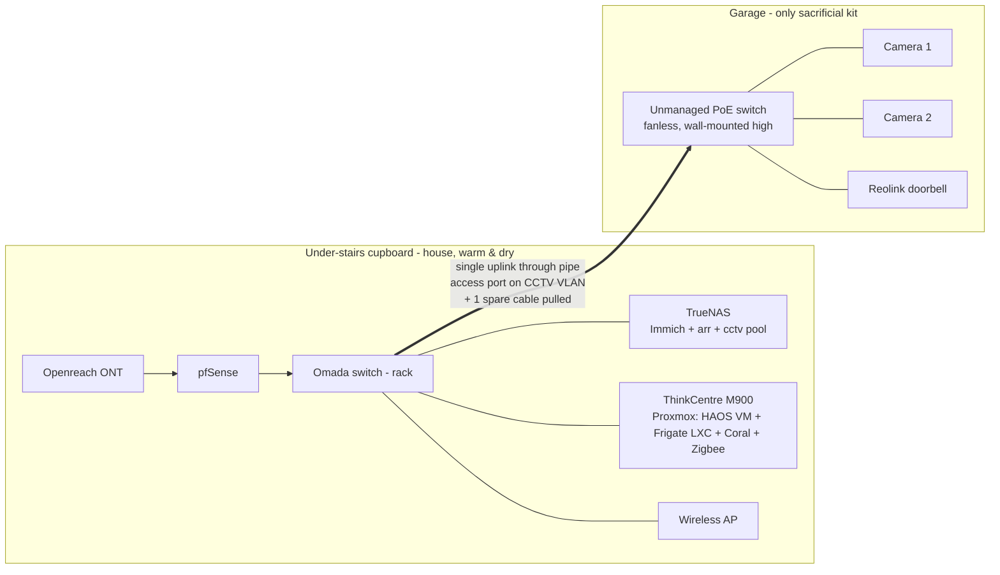

# Frigate CCTV + Home Assistant Project

Planning doc for adding self-hosted CCTV (Reolink PoE doorbell + 2 PoE
cameras via Frigate) and a Home Assistant / Zigbee-Matter hub, without
disturbing the existing Immich and arr stacks.

**Status:** planning. Electricians booked (~early Aug 2026) to fit the
Reolink doorbell + 2 PoE cameras and wire them into the garage.

## Goals & constraints

- Self-host the cameras with **Frigate** (NVR + object detection).
- **Do not** add load to the TrueNAS box that runs Immich + arr.
- **Do not** record footage onto the main storage pools.
- Keep expensive/critical gear (router, switch, NAS, HA box) out of the
  damp garage. Only sacrificial/outdoor-rated kit goes outside.
- Home Assistant + Zigbee/Matter radio must stay in the house (breeze
  block + concrete kills 2.4 GHz / 802.15.4 RF).

## Key decisions

| Decision | Choice | Why |
|----------|--------|-----|
| Where Frigate runs | Lenovo ThinkCentre M900 (i5-6500T, 16 GB) alongside HA | QuickSync iGPU for decode; keeps CCTV load off TrueNAS |
| Detector | **OpenVINO on the iGPU** first; add Google Coral USB later if needed | OpenVINO is free and fine for 3 cams; Coral adds headroom |
| GPU on TrueNAS | **No** | Frigate isn't running there; nothing to accelerate |
| Footage storage | Old 2 TB drive(s) in a **dedicated `cctv` pool inside TrueNAS**, NFS to Frigate | Internal SATA only — ZFS + USB caddy is unreliable for 24/7 writes |
| Frigate DB location | ThinkCentre **local SSD** (not NFS) | Frigate's SQLite DB on NFS corrupts/locks up; media on NFS is fine |
| Rack location | **Stays in the house** | Once TrueNAS/HA/ONT are all indoors, nothing else needs the garage |
| In the garage | Only a **PoE switch** + the outdoor cameras | Cheap/replaceable; cameras are IP65+ and don't care about damp |
| Cabling through the pipe | **1 uplink (+1 spare)** | No WAN run needed; garage is just camera aggregation |
| Garage switch type | **Unmanaged fanless PoE** switch | House uplink = access port on CCTV VLAN, so the garage switch stays dumb |
| Hypervisor on ThinkCentre | **Proxmox**: HAOS VM + Frigate LXC | Clean iGPU sharing + isolation; matches existing Proxmox skills |
| ThinkCentre as a Talos node | **No** — keep it appliance-tier | CCTV/HA must not reboot when the cluster is upgraded/tinkered with; one extra host doesn't buy true HA anyway |
| Provisioning HA/Frigate | **OpenTofu (bpg/proxmox)** for the VM + LXC; app config in git | Consistent with existing `opentofu/`; Tofu wires compute + devices, not in-guest config |
| Zigbee vs Thread radio | **Zigbee-first** on the ZBT-1 | Thread has no coverage advantage (same 802.15.4/2.4 GHz); cheap IKEA sensors are Zigbee |

## Topology

Data flow: camera RTSP streams cross the uplink to Frigate on the
ThinkCentre; Frigate writes recordings back over NFS to the TrueNAS
`cctv` pool. Both directions are only a few Mbps — trivial on gigabit.
Cameras sit on an isolated **CCTV VLAN** and are firewalled from the
rest of the network.

## Proxmox layout on the ThinkCentre

- **HAOS in a VM** — keeps the HA Supervisor, add-ons, and one-click
  backups. Pass the **Zigbee/Matter USB dongle** through to this VM.
- **Frigate in an LXC** (not a VM) — bind-mount `/dev/dri` into the
  container for QuickSync (VAAPI decode) + OpenVINO detection, and pass
  the **Coral USB** in. LXC shares the host kernel, so the single iGPU
  isn't locked to one guest and there's no VFIO/single-GPU-passthrough
  pain.
- The "HA runs better on bare metal" belief is a myth for this workload
  — HA is I/O-light and VM overhead is imperceptible. Isolation
  (independent reboots, per-guest snapshots) is the real win here since
  the box runs two workloads.
- **Alternative considered:** plain Debian + Docker Compose (HA
  Container + Frigate + Zigbee2MQTT). Fits the existing Dockhand/compose
  workflow but loses the HA Supervisor/add-ons and HA's built-in
  backups. Proxmox chosen for the add-on ecosystem + cleaner isolation.

### Not a Talos node

The ThinkCentre stays **appliance-tier** — it is deliberately *not*
added to the Talos cluster. Frigate's footprint with hardware offload is
modest (~1-2 bursty cores, ~1-2 GB RAM for 3 cameras), so resources
aren't the blocker; **availability coupling** is. CCTV + HA must stay up
while the cluster gets drained/upgraded/experimented on. And true
control-plane HA needs **3 separate physical hosts** for etcd quorum, so
one extra host wouldn't deliver it anyway — Talos expansion waits for
dedicated hardware.

### Provisioning with OpenTofu (bpg/proxmox)

Provisioned the same way as the rest of `opentofu/`. The provider has
native support for everything needed:

- **HAOS VM** — `proxmox_virtual_environment_vm` +
  `proxmox_virtual_environment_download_file` (pull the HAOS `.qcow2`,
  `disk.import_from` it) + a **`usb { }`** block to pass the Zigbee
  ZBT-1 dongle into the VM.
- **Frigate LXC** — `proxmox_virtual_environment_container` with:
  - `device_passthrough { path = "/dev/dri/renderD128" }` for the iGPU
    (QuickSync + OpenVINO) — native, no hand-edited `lxc.conf`.
  - a second `device_passthrough` for the Coral USB device node.
  - a `mount_point` bind-mounting the NFS footage path into the LXC.
  - `features { nesting = true }` to run Frigate as a container inside.

**Boundary:** Tofu provisions compute + device wiring only. In-guest
config is out of scope — HAOS is onboarded via its web UI (can't be
cloud-inited), and Frigate's `config.yml` + `docker-compose.yml` are
**version-controlled in this repo** (Dockhand-style) and bind-mounted
into the LXC. The stack + bring-up/testing steps live in
`homeassistant-box/docker-compose/frigate/`.

**Gotcha:** pass USB devices by a cluster **resource mapping**
(`mapping = ...`), not raw bus/port — re-plugging into a different port
otherwise breaks the passthrough.

## Storage

- Create a dedicated pool `cctv` from the old 2 TB drive(s) **inside**
  the TrueNAS chassis (2-drive mirror for resilience, or single-drive
  since footage is disposable). Keep it separate from the main pools.
- Export via **NFS**; mount on the ThinkCentre; point Frigate's `record`
  path at it. **Keep Frigate's config + SQLite DB on the local SSD.**
- Retention: ~3 cameras continuous at 4 MP / ~2 Mbps ≈ **65 GB/day**, so
  a single 2 TB ≈ **~1 month** of 24/7 footage. Record-on-motion extends
  this significantly. 2 TB is ample.
- The external USB caddy is **not** used for CCTV — repurpose it for
  offline backups elsewhere.

## Networking

- The rack staying in the house **collapses the cabling problem**: no
  WAN run to the garage, no 4-cable pull. Only **one uplink** is needed
  through the pipe (the existing Cat6a probably already does it). Pull
  **one spare** while the pipe is open — re-pulling later is misery.
- Configure the house-side uplink port as an **access port on a
  dedicated CCTV VLAN** in Omada. Every port on the dumb garage switch
  then lands on that VLAN, keeping cameras isolated and firewalled.
- PoE budget: 3 Reolink devices (~6-12 W each, doorbell is 802.3af). A
  4-5 port switch with ~60 W budget is plenty.

## Home Assistant / Zigbee-Matter

- **HA box + radio stay in the house.** Zigbee is 2.4 GHz / 802.15.4 and
  will not survive breeze block + the concrete floor above the garage.
- Use the **HA Connect ZBT-1** (official SkyConnect successor; Zigbee +
  Thread). Mount it on a **USB extension cable** to escape USB 3 / SSD
  interference — fixes most "flaky Zigbee" complaints.
- **Run it as a Zigbee coordinator (Zigbee-first).** ZBT-1 does Zigbee
  *or* Thread, not both well at once (multiprotocol firmware is
  experimental). Only add Thread later (second stick / Thread Border
  Router — Apple TV / HomePod / Nest Hub can serve) if a Matter-only
  device demands it.
- **Matter is not a radio — it has no coverage of its own.** It runs
  over Wi-Fi/Ethernet/Thread. Thread and Zigbee are *both* 802.15.4 on
  2.4 GHz — same propagation, so Matter-over-Thread does **not**
  penetrate breeze block any better than Zigbee. Coverage comes from
  mesh router nodes, not the protocol.
- **IKEA sensors** (PARASOLL door/window, VALLHORN motion, BADRING
  water) are **Zigbee** — pair directly into ZHA/Zigbee2MQTT with the
  ZBT-1, no DIRIGERA hub or Matter needed. Cheap and well-supported.
  (Verify the SKU at purchase — IKEA is shifting newer gear to
  Thread/Matter.)
- Extend Zigbee toward the garage with mains-powered Zigbee devices
  (smart plugs/bulbs near the garage door) — they act as mesh routers.

## Garage environment

- Attached garage with a **home battery + hot-water cylinder** giving off
  heat, and a heated room above, is far milder than a detached box —
  those heat sources help keep it above the dew point.
- Real risk is **condensation on cold metal during temperature swings**,
  which is death for spinning drives / mains PSUs but shrugged off by a
  PoE switch. Cameras/doorbell are IP65+ and don't care.
- Hardening for the garage switch:
  - **Fanless** model (no moisture/dust intake, silent). Industrial
    wide-temp models cost pennies more if extra peace of mind is wanted.
  - Mount **high on an internal wall** (warm air rises; avoid the cold
    external wall and floor damp).
  - Add a **Zigbee temp/humidity sensor** next to it → HA alerts on damp
    trends (good first automation).

## Shopping list

| Item | Purpose | Rough £ |
|------|---------|---------|
| HA Connect ZBT-1 dongle | Zigbee/Thread radio | ~£30 |
| USB extension cable | Get the dongle away from the box | ~£5 |
| Google Coral USB TPU *(optional/later)* | Detection headroom beyond OpenVINO | ~£60-80 |
| Unmanaged fanless PoE switch (4-5 port) | Camera aggregation in the garage | ~£40-60 |
| Cat6a spare pull + keystones/faceplates | 1 uplink + 1 spare through the pipe | ~£25 |
| Old 2 TB drive(s) | `cctv` pool (already owned) + SATA cable/power if bays free | owned |
| Zigbee temp/humidity sensor | Monitor the garage switch environment | ~£15 |
| Reolink PoE doorbell + 2× PoE cameras | (already ordered) | — |

The external USB caddy is **repurposed**, not bought for this.

## Phased plan

**Now → before the electricians (prove it on the bench):**
1. Install Proxmox on the ThinkCentre; create the HAOS VM and the Frigate
   LXC (with `/dev/dri` bind-mount).
2. Stand up Frigate with the **OpenVINO** detector (no Coral yet). Point
   it at a test RTSP source (spare camera or a phone RTSP app) to
   validate detect → record end-to-end.
3. Create the `cctv` pool on TrueNAS; export NFS; mount on the
   ThinkCentre; confirm Frigate records there with the **DB kept local**.
4. Buy the ZBT-1 + USB extension; get Zigbee running.

**Electrician day:**
5. Doorbell + 2 cameras wired to the garage PoE switch.
6. Pull the spare Cat6a through the pipe; confirm the uplink; set the
   house-side port as a CCTV-VLAN access port.

**After:**
7. Add cameras to Frigate — **substream for `detect`, main stream for
   `record`** (Reolink best practice). Tune zones/masks.
8. Decide on the Coral if OpenVINO is tight.
9. Add the garage temp/humidity sensor + a low-temp/high-humidity alert.

## Open questions

- [ ] Pipe internal diameter — does a second Cat6a spare fit alongside
      the existing run?
- [ ] Coral USB availability/price at purchase time (OpenVINO covers the
      gap if not).
- [ ] HAOS `.qcow2` import quirks via bpg/proxmox (raw vs qcow2 handling)
      — validate on first `tofu apply`.

_Resolved:_ Zigbee-first on the ZBT-1 (Thread has no coverage edge);
ThinkCentre stays an appliance, not a Talos node.
